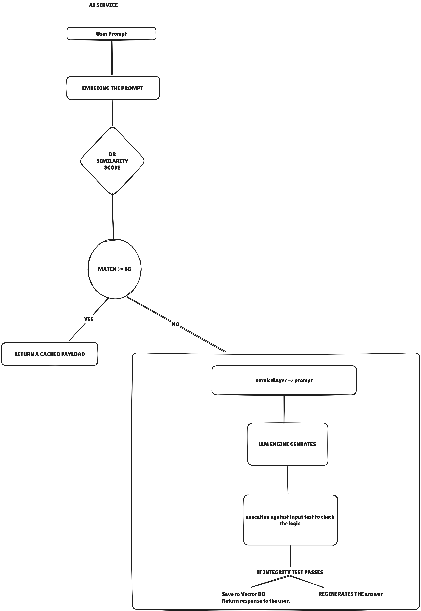

# CoderX AI Service

CoderX AI Service is a FastAPI-based backend that generates high-quality coding problems, validates their reference solutions, optionally creates visual assets, and returns a structured payload ready for frontend consumption. The service is designed to produce problem content dynamically from a user prompt and cache similar requests for reuse.

## Overview

This project combines four core capabilities:

- Problem generation using an LLM (currently Groq)
- Automated reference-solution validation by executing Python code in a subprocess
- Optional visual asset generation for diagrams or illustrations
- Semantic caching using Pinecone vector search to reduce repeated work

The resulting API returns a complete problem object with:

- title and description
- difficulty and topic
- test cases
- starter code snippets in Python, Java, and C++
- editorial-style reference solution
- visual payload and image URL when applicable

## Architecture


The service is organized around a lightweight pipeline:

1. A client sends a prompt to the API.
2. The problem service checks whether a similar prompt already exists in the Pinecone cache.
3. If no suitable cache hit is found, the LLM generates a structured problem payload.
4. The generated reference solution is executed against the provided test inputs to verify that it works.
5. A visual connector creates either a Mermaid-based diagram URL or an image URL.
6. The final payload is stored in the vector database and returned to the client.

### High-level flow

```text
Client Request
    -> FastAPI endpoint
    -> ProblemService
        -> Vector cache lookup (Pinecone)
        -> LLM generation (Groq)
        -> Solution verification (subprocess runner)
        -> Visual generation (Mermaid / Hugging Face / Pollinations)
        -> Final payload + cache save
```

## Project Structure

```text
app/
  main.py                  # FastAPI app entrypoint and API routes
  config/
    config.py              # Environment settings and config loading
    exception.py           # Custom application exceptions
    logger.py              # Structured JSON logging
  db/
    pineConeDB.py          # Pinecone vector store implementation
  interfaces/
    llmInterface.py        # LLM abstraction interface
    runnerInterface.py     # Execution interface
    vectorInterface.py     # Vector store interface
    visualInterface.py     # Visual service interface
  llm/
    GroqInterface.py       # Groq-based LLM integration and validation logic
    OllamaInterface.py     # Optional alternative integration (currently commented out)
  models/
    model.py               # Pydantic models for request/response schemas
  prompts/
    generationPrompt.py    # System prompt used for problem generation
  services/
    problem_service.py     # Main orchestration service
    subprocessRunner.py    # Executes reference solutions in subprocesses
    visual_service.py      # Diagram/image generation connector
    subprocess_execution.py
  static/
    generated_images/      # Generated image assets
  test/
    pipelineChecker.py     # Basic validation or smoke-check logic
```

## Core Components

### 1. FastAPI application

The entrypoint is app/main.py. It:

- initializes the application lifecycle
- creates the shared problem service instance
- exposes the API endpoints
- mounts the static assets directory for generated visuals

### 2. Problem orchestration

The primary orchestration layer is app/services/problem_service.py. It coordinates the complete generation pipeline and decides whether to use cached content or generate a new problem.

### 3. LLM integration

The implementation in app/llm/GroqInterface.py talks to Groq and validates the generated problem JSON. It retries when the LLM output is malformed or when the produced solution fails execution-based checks.

### 4. Solution verification

The subprocess runner in app/services/subprocessRunner.py executes the generated reference solution against the supplied test cases. This helps ensure that the returned solution is not just syntactically plausible but actually runnable.

### 5. Visual generation

The visual connector in app/services/visual_service.py handles one of two common patterns:

- Mermaid-based diagrams for tree/graph/grid/linked-list-style problems
- Image generation for illustration-style prompts using Hugging Face or Pollinations fallback

### 6. Vector caching

The Pinecone integration in app/db/pineConeDB.py stores generated problem payloads by embedding the user prompt. This allows future similar prompts to be served from cache when the similarity threshold is met.

## API Surface

### Health check

- GET /health
- Returns a simple status response confirming the service is up

### Generate problem

- POST /api/v1/generate-problem
- Request body: a JSON object containing a prompt

Example request:

```json
{
  "prompt": "Generate a medium difficulty binary tree problem with a visual diagram"
}
```

Example response:

```json
{
  "title": "Invert Binary Tree",
  "description": "Write a function that inverts a binary tree.",
  "difficulty": "medium",
  "topic": "binary_tree",
  "testCases": [],
  "codeSnippets": [],
  "editorial": "### Optimal Solution Walkthrough",
  "imageUrl": null,
  "visual": {
    "hasVisual": false,
    "type": "none",
    "url": null,
    "diagramCode": null
  },
  "_cache_hit": false
}
```

## Request and Response Models

The request and response types are defined in app/models/model.py.

### Main request model

- ProblemRequest
  - prompt: string

### Main response model concepts

- GeneratedResponse
  - title
  - description
  - difficulty
  - testCases
  - codeSnippets
  - editorial
  - topic
  - imageUrl
  - visual
  - \_cache_hit
  - \_similarity

## Environment Configuration

The service expects a root-level .env file with the variables below.

```env
GROQ_API_KEY=your_groq_api_key
GROQ_MODEL=llama-3.3-70b-versatile
GROQ_MAX_TOKENS=4096
TEMPERATURE=0.7

PINECONE_API_KEY=your_pinecone_api_key
PINECONE_INDEX_NAME=coderx
PINECONE_NAMESPACE=coding_Prompts

HF_TOKEN=your_huggingface_token

APP_NAME=CoderX_AI_SERVICE
ENV=development
PORT=8000
```

### Notes

- The app uses pydantic-settings to load values from .env.
- Missing credentials can cause the service to fail during initialization.
- The visual service only uses Hugging Face if HF_TOKEN is present; otherwise it may fall back to other image generation URLs.

## Setup and Installation

### Prerequisites

- Python 3.10+
- pip or uv
- Access to Groq
- Access to Pinecone
- Optional: Hugging Face token for image generation

### Install dependencies

```bash
pip install -e .
```

Or with uv:

```bash
uv sync
```

## Running the Service

### Development mode

```bash
uvicorn app.main:app --reload --port 8000
```

### Production-style run

```bash
uvicorn app.main:app --host 0.0.0.0 --port 8000
```

Once running, the API will be available at:

- http://localhost:8000/docs for Swagger UI
- http://localhost:8000/redoc for ReDoc

## Generation Pipeline in Detail

### Step 1: Cache lookup

The service first checks Pinecone for a semantically similar prompt. If a high-confidence match exists, the cached payload is returned immediately with \_cache_hit: true.

### Step 2: LLM problem generation

If no cache hit is found, the system prompt in app/prompts/generationPrompt.py guides the LLM to produce a complete JSON problem object. The prompt is intentionally strict and requires:

- valid JSON
- self-contained reference solutions
- test case inputs and expected outputs
- code snippets for multiple languages
- optional visual metadata

### Step 3: Execution-based verification

The generated reference solution is executed inside a subprocess. The runner attempts to validate the solution and capture output for supplied test cases. Any broken solution is treated as a generation failure and triggers retry logic.

### Step 4: Visual asset selection

Depending on the generated problem metadata:

- Mermaid diagrams are encoded into a URL for frontend rendering
- Illustration-style problems can generate image URLs
- If no visual is needed, the visual payload is set to a disabled state

### Step 5: Final response and caching

The final response is assembled into a clean payload and then stored inside Pinecone so the next similar request can be served much faster.

## Design Notes

### Why subprocess execution?

The current implementation validates generated solutions by running them in a subprocess rather than trusting the LLM output. This makes the system more robust and helps reduce invalid or non-executable code.

### Why vector caching?

Caching reduces repeated generation costs and improves latency when multiple users request similar problems. The service currently uses Pinecone for semantic similarity matching rather than simple exact-string matching.

### Why structured models?

The application uses Pydantic models to enforce a clear contract between generation, validation, and API output. This helps keep the problem payload consistent and easier to evolve.

## Extensibility

The architecture is already structured for extension:

- Replace Groq with another provider by implementing the LLM interface
- Swap Pinecone for another vector database by implementing the vector interface
- Add more visual providers or renderers
- Introduce asynchronous execution for larger workloads
- Add authentication and rate limiting for production deployments

## Current Limitations

- The service currently depends on a live Groq and Pinecone configuration.
- Visual generation is best-effort and may fall back to external URLs when image generation is unavailable.
- The subprocess execution path is synchronous, so heavy traffic may require async processing in the future.
- The current project is a backend service focused on problem generation rather than a full end-to-end learning platform.

## Suggested Next Improvements

- Add authentication and API keys for clients
- Add request rate limiting
- Add stronger validation for generated problem quality
- Add support for asynchronous job queues
- Add unit and integration tests around the full pipeline
- Add Docker support for easier deployment

## License

This project is currently intended for internal experimentation and development use. Add your preferred license if you plan to distribute or commercialize it.
